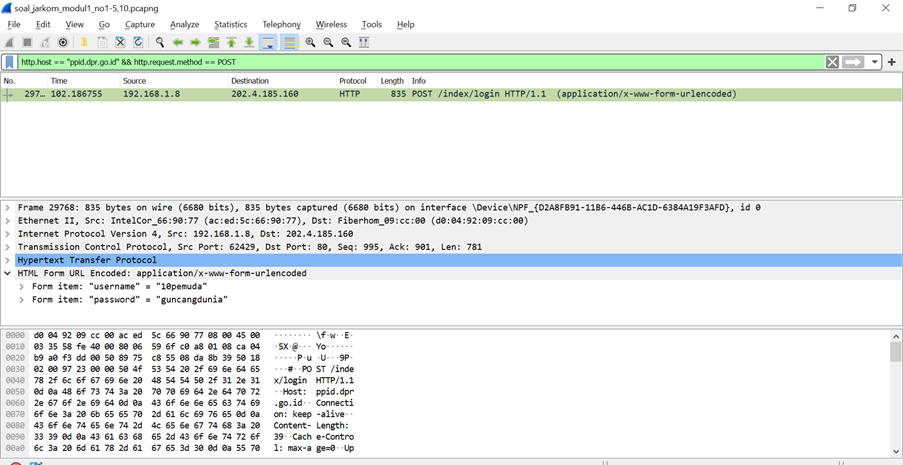

# Jarkom_Modul1_Praktikum_B07

#### 1. Sebutkan webserver yang digunakan pada "testing.mekanis.me"!
Display filter dengan syntax
```
http.host == testing.mekanis.me
```


lalu follow TCP stream dan lihat webservernya. Webserver : nginx/1.14.0(ubuntu)


#### 2. Simpan gambar "Tim_Kunjungan_Kerja_BAKN_DPR_RI_ke_Sukabumi141436.jpg"!
Export HTTP, setelah itu mencari nama image yang akan dicari pada text filter. Lalu save object gambar


#### 3. Cari username dan password ketika login di "ppid.dpr.go.id"!
Display filter dengan syntax
```
http.host == "ppkl.dpr.go.id" && http.request.method == POST
```
Username : 10pemuda
password : guncangdunia


#### 4. Temukan paket dari web-web yang menggunakan basic authentication method!
Display Filter dengan syntax
```
http.authorization contains Basic
```

#### 5. Ikuti perintah di aku.pengen.pw! Username dan password bisa didapatkan dari file .pcapng!
Display filter dengan syntax
```
http.host == "aku.pengen.pw"
```


dapatkan username dan password pada Authorization
username : kakakgamtenk
password : hartatahtabermuda
lalu masuk ke web tersebut dan masukan username dan passwordnya. Kemudian lakukan instruksi didalamnya (isi urutan konfigurasi kabel T568B)


#### 6. Seseorang menyimpan file zip melalui FTP dengan nama "Answer.zip". Simpan dan Buka file "Open This.pdf" di Answer.zip. Untuk mendapatkan password zipnya, temukan dalam file zipkey.txt (passwordnya adalah isi dari file txt tersebut).
Ctrl + f, cari paket list dengan "Answer.zip" dan "zipkey.txt". Cari yang baris dengan kolom protocolnya "FTP-Data". setelah itu Klik kanan, follow -> TCP Stream. Ubah dari ASCII ke Raw. Save as dengan nama dan ekstensi yang sesuai dengan file yang akan disave


#### 7. Ada 500 file zip yang disimpan ke FTP Server dengan nama 1.zip, 2.zip, ..., 500.zip. Salah satunya berisi pdf yang berisi puisi. Simpan dan Buka file pdf tersebut. Your Super Mega Ultra Rare Hint = nama pdf-nya "Yes.pdf"
Cari menggunakan find dengan filter hex code dan masukan kode hex dari "Yes.pdf" yaitu 59 65 73 2e 70 64 66


follow TCP stream dan save file zip tersebut dan buka


#### 8. Cari objek apa saja yang didownload (RETR) dari koneksi FTP dengan Microsoft FTP Service!
Display Filter dengan syntax
```
ftp.request.command == RETR
```

#### 9. Cari username dan password ketika login FTP pada localhost!
Display filter dengan syntax
```
http.request.command == USER || http.request.command == PASS
```


#### 10. Cari file .pdf di wireshark lalu download dan buka file tersebut! clue: "25 50 44 46"
Lakukan find dengan kode hex 25 50 44 46


follow TCP stream dan save file pdf tersebut


#### 11. Filter sehingga wireshark hanya mengambil paket yang mengandung port 21!
Capture filter dengan syntax
```
port 21
```


#### 12. Filter sehingga wireshark hanya mengambil paket yang berasal dari port 80!
mengcapture packet dari port 80, maka source nya ada pada port 80
```
src port 80
```

#### 13. Filter sehingga wireshark hanya menampilkan paket yang menuju port 443!
Capture filter dengan syntax
```
dst port 443
```


#### 14. Filter sehingga wireshark hanya mengambil paket yang berasal dari ip kalian!
Mencari Informasi IP Address pada PC, jika di windows melihat di Network Properties. Setelah itu Capture filter dengan syntax
```
src net 192.168.1.9
```

#### 15. Filter sehingga wireshark hanya mengambil paket yang tujuannya ke monta.if.its.ac.id!
Capture filter dengan syntax
```
dst host monta.if.its.ac.id
```


